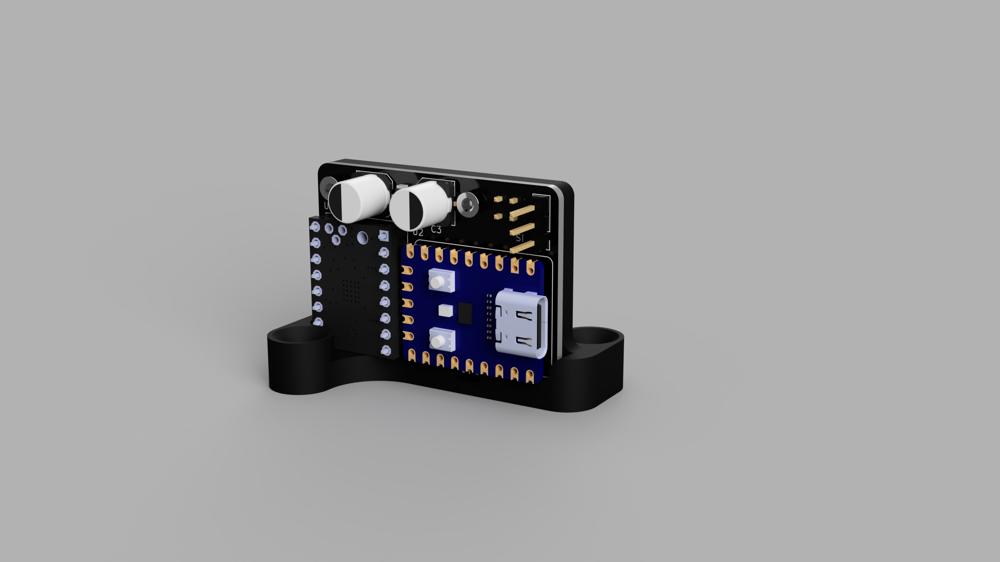
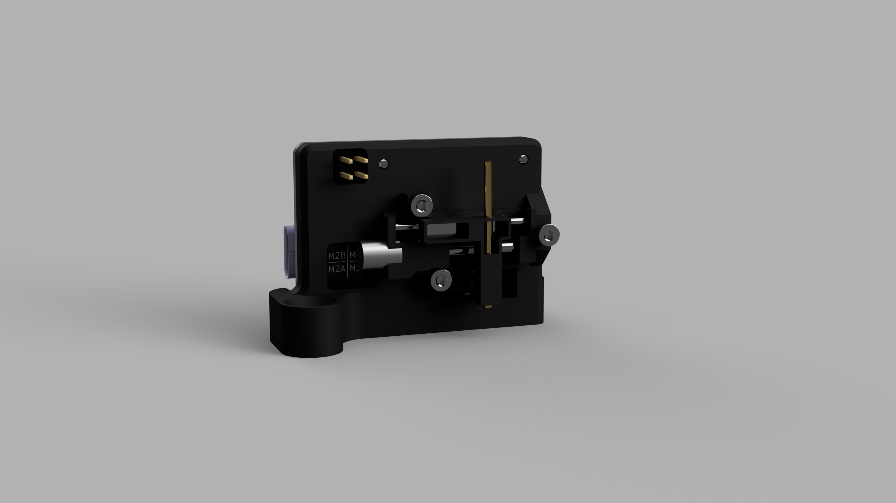

# RPiLinearServo



A closed-loop linear servo based on the RP2040, using a micro stepper linear actuator with an 8.5 mm throw and a BTT v1.3 TMC2209 driver. Designed as an RC servo replacement / turnout actuator for model railroads that allows for smooth and reliable slow speed operation and ease of configuration for a wide range of applications.




## Features

- Controllable via standard servo PWM signal allowing for plug-and-play integration in systems designed for miniature R/C servos
- Easy firmware updates - just drag and drop compiled binary into mounted drive to flash
- Widely configurable by editing a `CONFIG.INI` file when device is connected as a usb drive to allow for adaptation to wide range of use cases
- Smooth, quiet, controllable, and repeatable motion not available in smaller servos
- Non-backdrivable lead screw linear stage can be powered off in a low power state while not in use
- Automatic homing routine runs once and is then stored and persists throughout the life of the device
- Closed loop magnetic feedback allows for seamless, accurate adjustments if external factors cause motor to miss steps
- Interactive USB CLI (via serial monitor) exposes full command set for motion control, diagnostics, and debugging


## Hardware

| Component | Details |
|---|---|
| MCU | Waveshare RP2040-Zero |
| Driver | BTT TMC2209 v1.3 SilentStepStick |
| Actuator | Micro stepper linear slide, 8.4 mm travel (~208.3 full steps/mm) |
| Hall Sensor | TI DRV5055 A2 (optional, for closed-loop verification) |

See the [PCB README](PCB/README.md) for the full schematic, BOM, and GPIO assignments.

## Getting Started

### Flash the firmware

1. Hold **BOOTSEL** on the RP2040-Zero and plug in USB.
2. Drag `RPiLinearServo.uf2` onto the **RPI-RP2** drive.
3. The board reboots and enumerates as a composite USB device (CDC serial + MSC config drive).

Pre-built `.uf2` files are available on the [Releases](../../releases) page — or build from source (see the [Firmware README](Firmware/RPiLinearServo/README.md)).

### Connect a PWM signal

Wire a standard RC servo signal (1000–2000 µs) to GP0. On the first valid pulse the servo automatically homes (drives into the hardstop, backs off, and zeroes) then begins tracking the PWM target.

If the PWM signal is lost for more than 100 ms (configurable), the motor is disabled and the LED enters an idle heartbeat.

### Configure via USB drive

The device mounts a small USB drive named **LINEARSERVO** containing `CONFIG.INI`. Edit with any text editor, save, and **safely eject**. The firmware applies changes within ~500 ms.

```ini
[stroke]
stroke_mm = 8.40
full_steps_per_mm = 208.3

[driver]
dir_invert = false
run_current_ma = 100
hold_current_ma = 50

[motion]
default_speed_mm_s = 40.0
max_accel_mm_s2 = 80.0
auto_disable_ms = 2000

[rc_pwm]
min_us = 1000
max_us = 2000

[led]
dark_mode = false

[power]
sleep_when_idle = false

[sensor]
use_hall_effect = false
```

### USB CLI

Connect a serial terminal (PuTTY, minicom, `screen /dev/ttyACM0 115200`) to the CDC port. The CLI is always active alongside PWM control.

```
> help
Commands:
  move <steps> [speed_hz]  Move relative steps (negative = reverse)
  run [speed_hz]           Continuous stepping
  stop                     Stop immediately
  home                     Run homing sequence
  enable                   Enable motor driver
  disable                  Disable motor driver
  dir <fwd|rev>            Set direction for 'run'
  speed <hz>               Set default speed
  ramp <from> <to> <steps> Linear speed ramp
  pos                      Print position
  status                   Print full status
  pwm                      Print PWM input status
  nvm                      Print/save position state
  hall                     Hall sensor reading
  hallcal                  Dump hall calibration table
  faultclr                 Clear stall fault
  help                     This message
```

## Project Structure

| Directory | Description | Details |
|---|---|---|
| [Firmware/RPiLinearServo](Firmware/RPiLinearServo/README.md) | RP2040 firmware (C++17, Pico SDK) | Build instructions, architecture, module reference |
| [PCB](PCB/README.md) | KiCad 8 schematic & PCB | BOM, GPIO map, sourcing notes, Gerber outputs |
| [Mechanical](Mechanical/README.md) | 3D-printable mounting hardware | Mount variants, print settings, additional parts |
| [Docs](Docs/) | Renders and specifications | Project renders, design spec |

## License

This project is licensed under the [MIT License](LICENSE).
